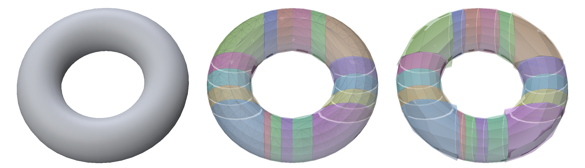
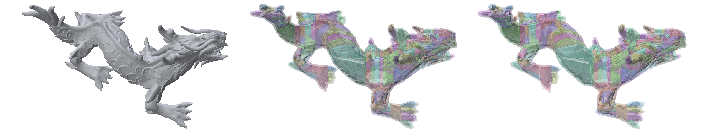

# CoACD → PCHS → Polyscope

A small Python example for trying a replacement convex hull simplifier. Run
[CoACD](https://github.com/SarahWeiii/CoACD) with its native decimation disabled,
pass each output hull to
[PCHS](https://github.com/alecjacobson/progressive-convex-hull-simplification),
and display the hulls over the original mesh in Polyscope.



Left to right: **original**, **unsimplified CoACD hulls over original**,
**PCHS hulls over original**. Corresponding hulls use the same color. PCHS
polygons are drawn directly, so their edges do not include triangulation diagonals.
The defaults are a **CoACD concavity threshold of `0.02`** and a **PCHS budget
of 18 polygon faces per hull**. The camera and image height fit the displayed
geometry with a small margin; PNGs are 2,400 pixels wide.

### Dragon

The same pipeline on `xyzrgb_dragon-720K.ply` (360,757 vertices, 721,510
triangles), with the same left-to-right layout:



```bash
OMP_NUM_THREADS=8 python example.py \
  ../sparse-solver-benchmark/xyzrgb_dragon-720K.ply \
  --headless --screenshot docs/dragon.png
```

The input mesh is external to this repository; replace the path with your local
copy. This uses the full input mesh, the example's `0.02` concavity threshold
and `auto` preprocessing, and disables native hull decimation.
CoACD produced **180 hulls in 51.47 seconds** on the test machine. PCHS took
**0.52 seconds total**: 171 hulls ended with 18 polygon faces and 9 already had
fewer faces (rendering excluded).

## Install

Use Python 3.10+ and Git. PCHS compiles a C++ extension, so a **C++17 compiler**
is also needed (e.g. `build-essential` on Ubuntu or Xcode Command Line Tools on
macOS). Pip installs the Python packages and fetches PCHS's build dependencies;
the first build can take a few minutes and needs network access.

```bash
python -m venv .venv
source .venv/bin/activate
python -m pip install --upgrade pip
CMAKE_ARGS="-DPCHS_BACKEND=NATIVE" CMAKE_BUILD_PARALLEL_LEVEL=2 \
  python -m pip install -r requirements.txt
```

These commands use PCHS's native backend (no CGAL installation needed).
The requirements pin the tested packages and PCHS commit. The `CMAKE_ARGS`
setting matters when pip builds PCHS, not when running the example.

## Run

```bash
# Built-in closed torus; opens the interactive Polyscope viewer.
python example.py

# Your own mesh. Trimesh loads OBJ, PLY, STL, etc.
python example.py path/to/shape.obj --target-faces 18

# For clean, closed inputs, skip CoACD's manifold preprocessing.
python example.py path/to/shape.obj --preprocess-mode off

# Linux headless render: saves the PNG and exits without entering a UI loop.
OMP_NUM_THREADS=4 python example.py --headless --screenshot docs/torus.png
```

The interactive viewer lets you toggle individual surfaces and adjust opacity.
All hulls in each overlay share the original's coordinate frame. Display copies
are scaled and shifted to arrange the comparison; the gray original in each
overlay is inset along its vertex normals by 0.2% of the bounding-box size to
avoid coincident-surface flicker. Neither algorithm receives this display inset.

[Headless Polyscope](https://polyscope.run/py/features/headless_rendering/)
uses `ps.init("openGL3_egl")`. Linux pip wheels include this backend, but the
machine needs an EGL graphics driver. On Ubuntu, a software-rendering setup can
use `sudo apt-get install libegl1 libegl-mesa0 libgl1-mesa-dri`;
set `LIBGL_ALWAYS_SOFTWARE=1` if necessary. On macOS, use the interactive viewer.

## Replace the simplifier

The important part of [example.py](example.py) is:

```python
raw_hulls = coacd.run_coacd(
    coacd.Mesh(vertices, triangles),
    threshold=0.02,
    decimate=False,  # Do not simplify CoACD's output hulls.
    extrude=False,
    apx_mode="ch",
    seed=0,
)
for hull_vertices, hull_triangles in raw_hulls:
    out_vertices, out_faces = simplify_hull(
        hull_vertices, hull_triangles, target_faces
    )
```

Edit only `simplify_hull()` to try another algorithm:

- **Input:** `(N, 3)` floating-point vertex positions and `(M, 3)` integer
  triangle indices, **zero-based and local to this hull**. Each hull goes directly
  from CoACD to this function in the input mesh's coordinate system.
- **Output:** vertex positions and a list of polygon index lists (or an integer
  triangle array), also zero-based and local to this hull.
- **Budget:** `--target-faces` counts PCHS supporting planes / polygon faces,
  **not vertices or triangulated faces**. PCHS can stop above the requested target
  if no further removal is possible. Actual output counts are printed per hull.

The PCHS adapter calls `pchs.simplify_convex_hull()` with the volume cost, then
unpacks its `(vertices, flat_indices, cumulative_offsets)` polygon representation
for Polyscope. It does not need a MATLAB bridge or a subprocess.

`max_ch_vertex` is deliberately absent: CoACD only uses that vertex budget when
`decimate=True`. CoACD's default merging remains enabled; the result is the normal
decomposition before native decimation. Preprocessing defaults to `auto`; use
`off` only for a suitably clean input. PCHS enlarges each convex hull conservatively;
this does not imply that the preceding approximate decomposition contains every
point of the original surface.

## Validation

Tested with Python 3.10 on Linux using the pinned dependencies and EGL rendering.
Both checked-in PNGs were rerendered with the defaults above. The torus produced
18 CoACD hulls (3.47 seconds), all simplified to 18 polygon faces (0.06 seconds
total). The dragon produced 180 hulls, with output counts described above.

Earlier smoke checks at threshold `0.05` and target 12 also covered OBJ loading
with preprocessing disabled, closed and consistently oriented output surfaces,
and containment of every unsimplified hull vertex in its simplified hull
(halfspace tolerance `1e-7`).
